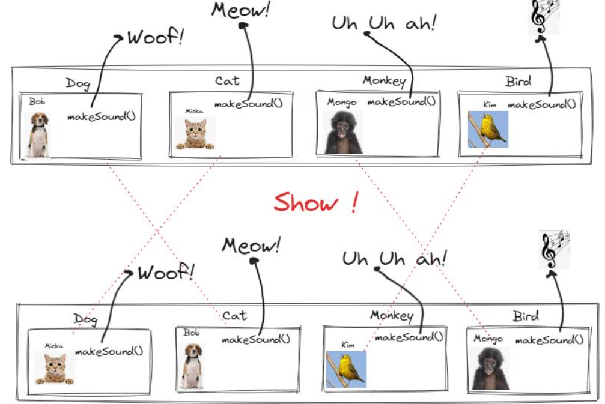

## Cookie: The funny circus

We need to create a circus app, the client can choose four animal categories for the show: Cat, Dog, Monkey, and Bird
Once the client press show(Circus.show())  the app randomly blends the 4 animals, in such a way Bob the Dog might behave like a Bird...

I used an adapter strategy for avoid initial animals being modified. You know, after the show, animal need to come back to their homes.

## How to run it
Execute CircusApp main method. Run unit test to see what's happening behind the scenes

## Requirements
- jdk11
